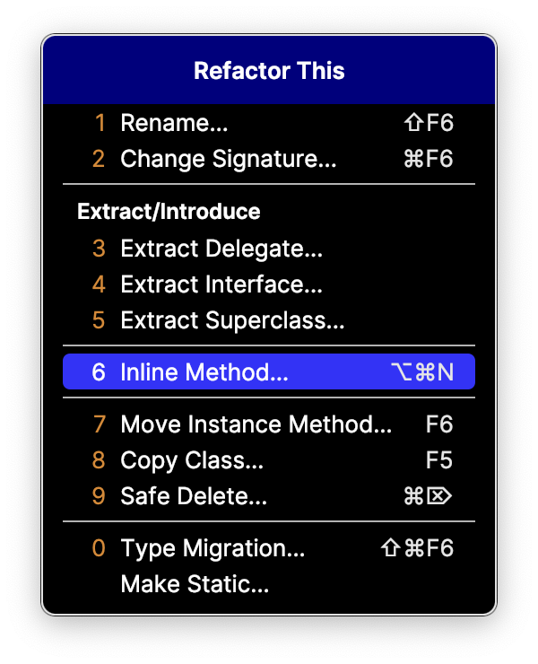

# 31

## 31장. 리팩토링

- 일반적인 리팩토링: 프로그램의 의미론을 유지하면서 코드를 수정하는 것입니다.
- TDD에서의 의미론: 테스트
- TDD의 리팩토링: 테스트 통과 상태에 영향을 주지 않으면서 코드를 변경하는 것입니다.

관측상의 동치성

- 충분한 테스트: 현재 가진 테스트가 추측 가능한 모든 테스트를 대표함을 말합니다.
- 관측상의 동치성이 성립되려면 충분한 테스트가 있어야 합니다.

### 차이점 일치시키기

비슷한 두 코드를 합치는 방법

1. 단계적으로 비슷하게 만듭니다.
2. 두 코드가 같아지면 합칩니다.

### 변화 격리하기

- 일부만 바꾸려면, 그 부분을 격리해야 합니다.
- 그러면 되돌리기도 수월합니다.
- 메서드 추출(가장 일반적), 객체 추출, 메서드 객체 등

### 데이터 이주시키기

- 데이터의 형식을 바꾸려면, 일시적으로 중복(전과 후를 공존)시켜야 합니다.

### 메서드 추출하기

- 긴 메서드를 읽기 쉽게 만들려면, 메서드의 일부분을 별도의 메서드로 추출합니다.

### 메서드 인라인

- 제어 흐름이 너무 꼬여있거나 산재해있다면, 메서드를 인라인합니다.

### 인터페이스 추출하기

- 오퍼레이션에 대한 구현을 여러 개 만들어야 할 때, 해당 오퍼레이션을 담는 인터페이스를 만듭니다.

### 메서드 옮기기

- 원래 있어야 할 클래스로 옮깁니다.
- 필요하면 적절한 클래스를 만듭니다.

### 메서드 객체

- 메서드의 파라미터와 지역 변수가 많고 복잡하다면, 메서드를 객체로 만듭니다.
- 메서드 추출을 적용하기 어려운 코드를 간결하게 만들 수 있습니다.

### 매개 변수 추가

- 추가하고 컴파일러를 따릅시다.

### 메서드 매개 변수를 생성자 매개 변수로 바꾸기

- 인텔리제이 쓰시면 그냥 이거 한 다음, 같은 이름의 생성자 매개 변수를 추가하면 됩니다.
